easyManager是一个轻量化、核心化、简单易用的安卓系统管理工具,它非常适合在原生系统上使用.

[easyMangerSDK开发工具包](https://github.com/MrsEWE44/easyManagerSDK)

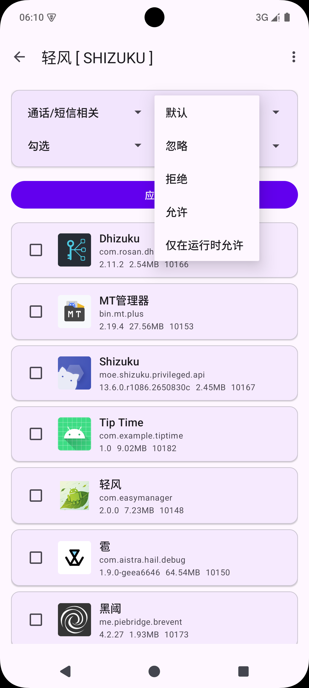 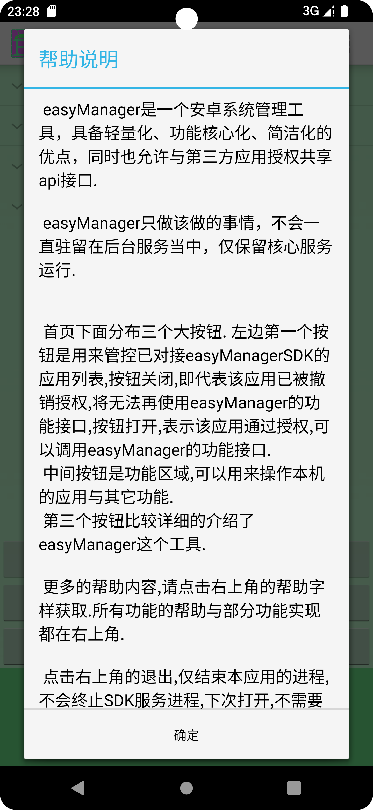 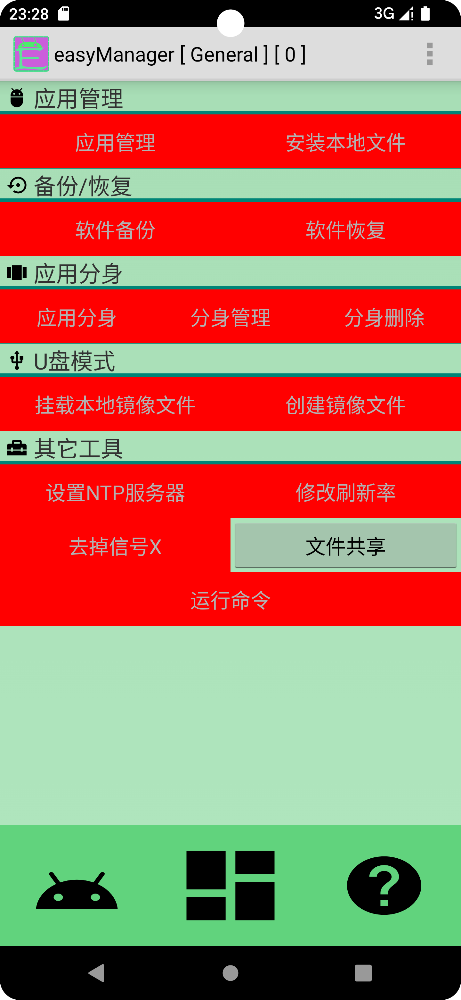 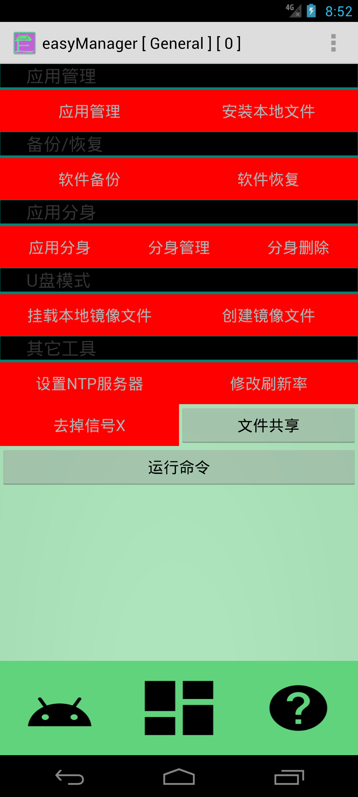
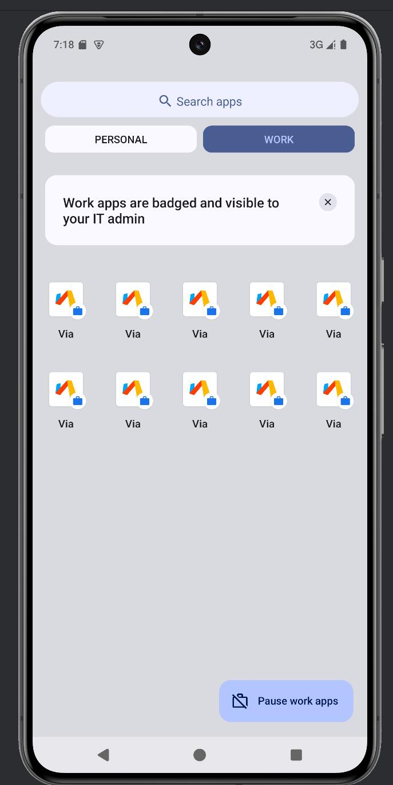 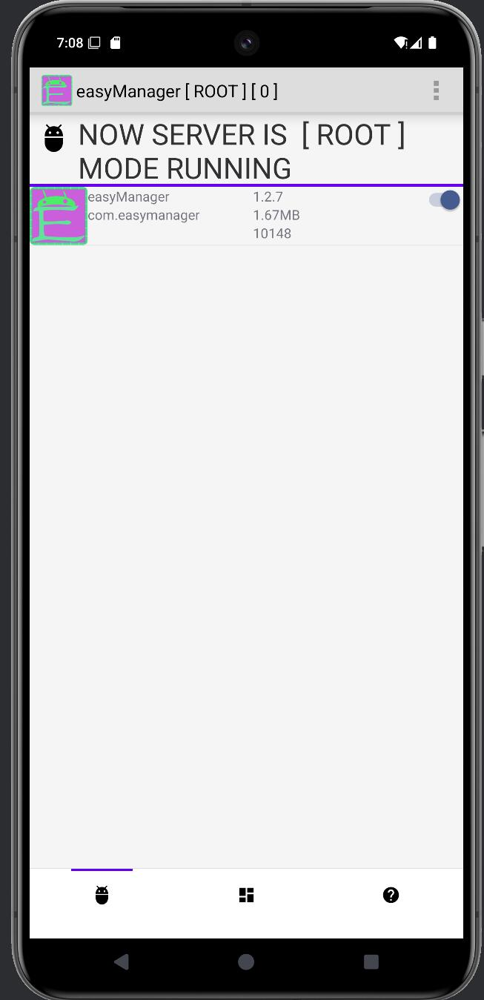 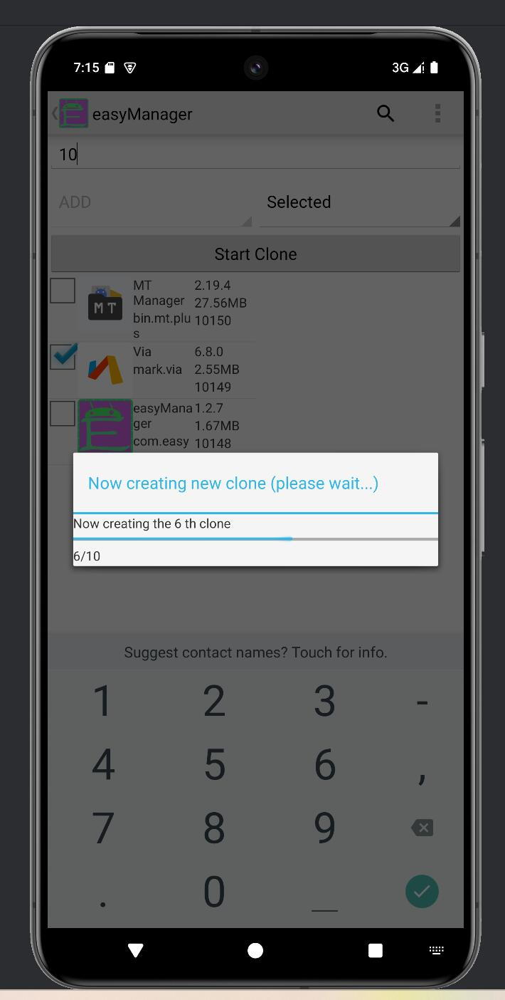 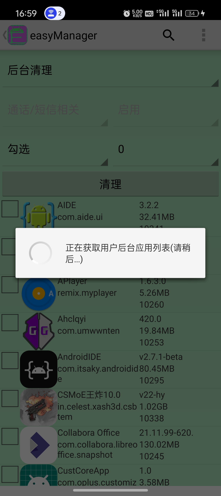
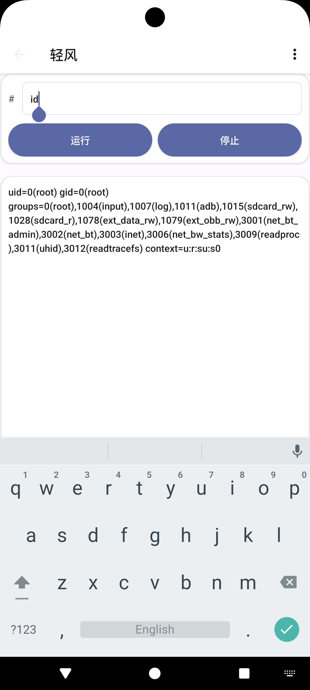 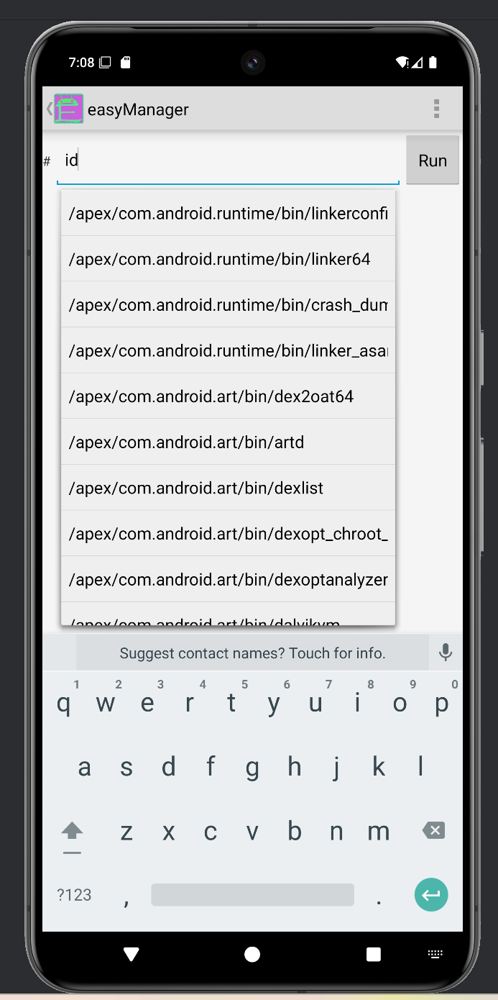 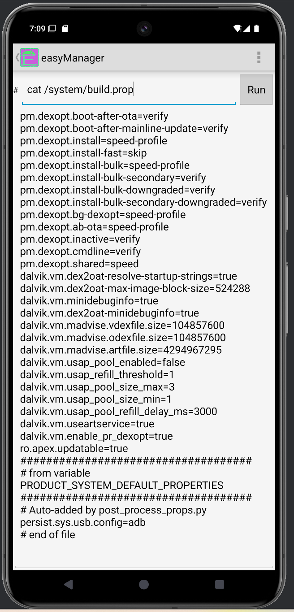 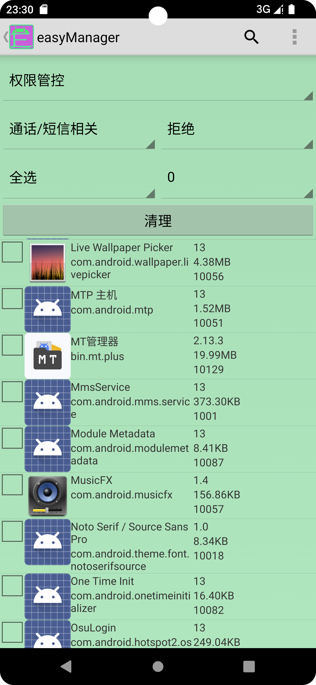
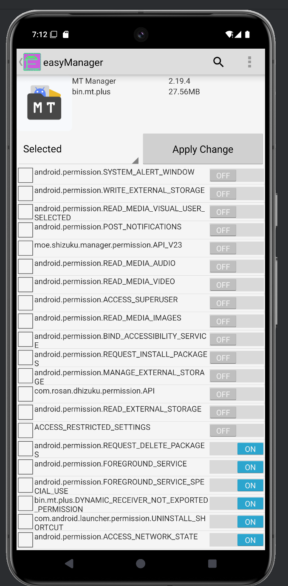 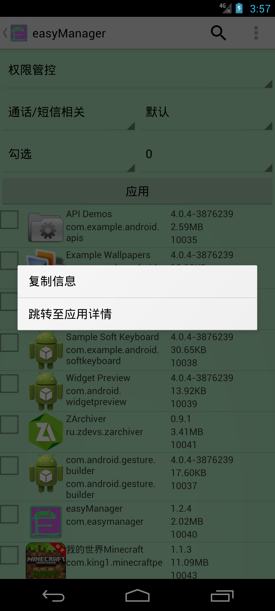

- V2.0.0beta

1.更改minisdk为26

2.修改版本号为2.0.0beta

3.全面对接Shizuku和Dhizuku

4.删减多余功能

5.初步调整界面部件

- V1.2.8b

1.修复运行命令的问题。

2.修复应用分身相关问题，可以正常分身、管理、备份、恢复。

3.修改版本号为1.2.8b。

- V1.2.8a

1.修复安卓16无法禁用程序的问题。

2.修复安卓16权限管理问题。

3.修改版本号为1.2.8a。

- V1.2.8

1.完善应用分身功能,支持安卓8以下自动删除多余组件。

2.修复执行命令功能。

3.添加设备管理员权限功能,支持应用停止和图标隐藏功能。

4.修改部分文字介绍。

5.修改打包名称格式。

6.修改版本号为1.2.8。

- V1.2.7

1.修复应用分身功能。

2.修复应用禁用、冻结功能。

3.完善文件共享功能。

4.初版界面更新。

5.提升target到36。

6.修改版本号为1.2.7。

- V1.2.6

1.优化获取已安装应用时，时间太久的问题。

2.其它忘了修复什么问题了。

3.修改版本号为1.2.6。

- V1.2.5

1.修复了U盘模式选择单个iso文件卡死的问题。

2.新增应用冻结、数据清楚、后台应用定时终止功能。

3.提升compileSdk为35。

4.优化功能体验。

5.修改版本号为1.2.5

- V1.2.4
  
1.U盘模式新增单个文件选择功能。

2.修复权限更改功能。

3.修复搜索时卡死的问题。

4.优化程序异常崩溃后，出现页面叠加的问题。

5.新增命令符提示下拉框、软件更新、项目地址跳转功能。

6.优化更多细节。

7.修改版本号为1.2.4

- V1.2.3b

1.完善应用删除功能，使其可以正常删除系统内置应用。

2.优化操作界面，删减多余按钮选项。

3.添加安卓4.0.x最低支持。

4.添加运行命令功能界面。

5.更新easyManager工程的Gradle版本。

6.修改版本号为1.2.3b

- V1.2.3a

1.完善分身应用备份与恢复功能。

2.更新easyManagerSDK开发工具包,同步easyManager接口。

3.修改版本号为1.2.3a

- V1.2.3

1.新增应用分身功能。

2.增加多用户管理与操作功能。

3.修改版本号为1.2.3

- V1.2.2a

1.修复安装本地apk文件无法正确显示应用图标问题

2.修改版本号为1.2.2a

- V1.2.2

1.修复应用组件禁用失败问题

2.提升target至34

3.修改版本号为1.2.2

- V1.2.1

1.修复备份时无法备份obb问题

2.更改应用提取保存路径

3.修改版本号为1.2.1

- V1.2

1.修复众多bug

2.优化部分操作细节

3.加入多国语言,跟随系统语言改变而改变

4.修改版本号为1.2

- V1.1

1.修复选择栏里选项无法生效问题

2.修复文件共享路径无法展示完整内容问题

3.修复权限修改无法在安卓13上正常使用问题

4.修改版本号为1.1

- V1.0

初次构建.
