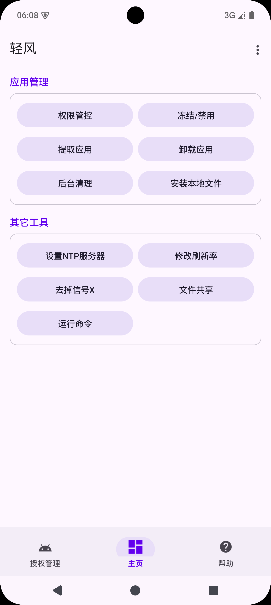
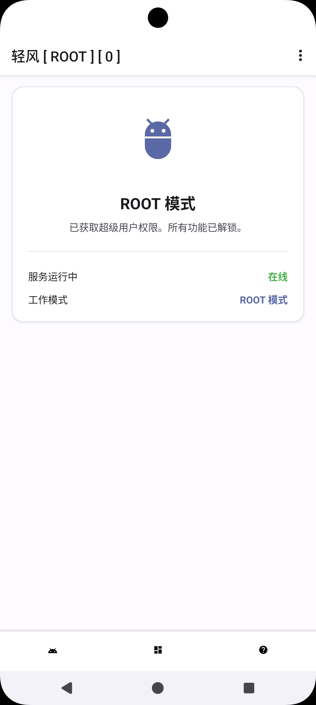
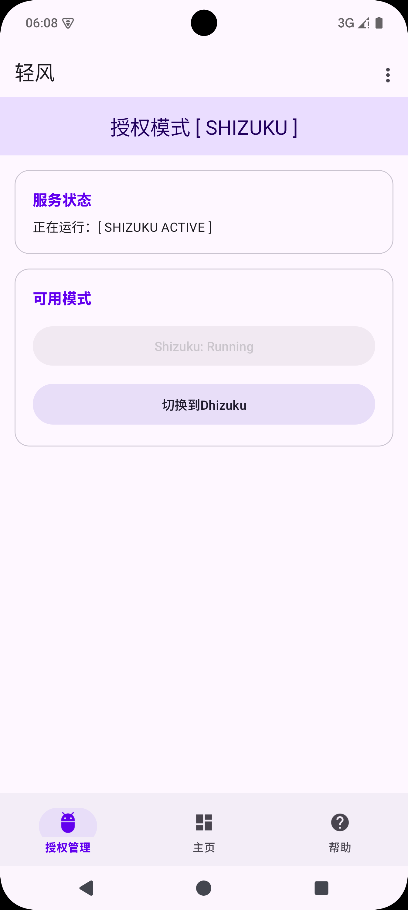
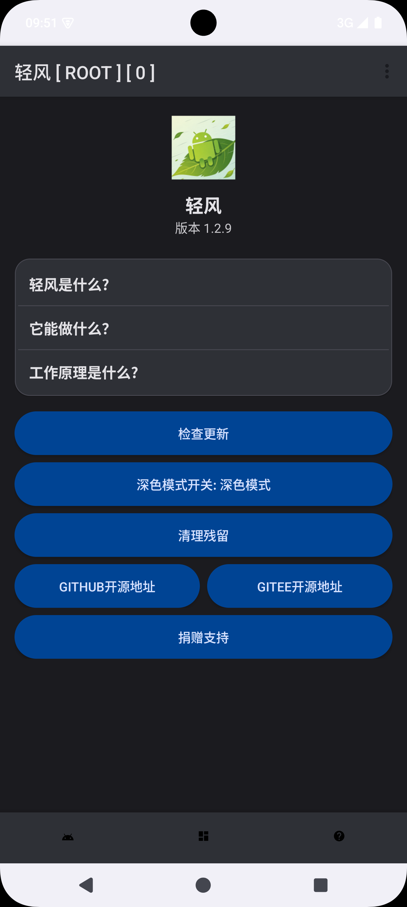

中文文档, [点这里](https://github.com/MrsEWE44/easyManager/tree/md5/README.md).

Light Breeze is a lightweight, focused and easy-to-use Android tool. It works well on customized systems from Chinese OEMs and supports dual-mode operation with Shizuku and Dhizuku, stable and simple to use.True to its name, Light Breeze comes gently and leaves quietly. It does no damage, oversteps no boundaries, and only focuses on its own duties with restraint and purity.

Starting with version V1.2.8b, this project is divided into two versions, which are maintained and updated separately: [Light Breeze No-Root Version](https://github.com/MrsEWE44/easyManager/tree/md5) and [Light Breeze Full Version](https://github.com/MrsEWE44/easyManager/tree/master).

Light Breeze supports powerfully deleting useless system software, freezing software, one-click silent installation of software, batch processing of software, system software recovery, and many more features in Shizuku mode. Download and experience it now!

The software supports Android 10 and above, and allows for network management in Shizuku mode without root access. It can also manage the permissions of the shake sensor, precisely control individual applications, and supports batch management.

- V2.0.2a

1.Fixed the issue where selecting a checkbox would return to the homepage.

2.Fixed the search function and moved the search button to the left of the menu options.

3.Added the ability to display system application menu options and functions.

4.Changed the version number to V2.0.2a.

### Software screenshots:

<table align="center" border="0" cellpadding="10">

  <tr>
    <td align="center">
       
      <b>图片1</b>
    </td>
    <td align="center">
       
      <b>图片2</b>
    </td>
    <td align="center">
       
      <b>图片3</b>
    </td>
  </tr>

  <tr>
    <td align="center">
       
      <b>图片4</b>
    </td>
    <td align="center">
       
      <b>图片5</b>
    </td>
  </tr>
</table>

### Donate & Support Authors

<table align="center" border="0" cellpadding="15">
  <tr>
    <td align="center">
       
      <b>微信</b>
    </td>
    <td align="center">
       
      <b>支付宝</b>
    </td>
  </tr>
</table>

