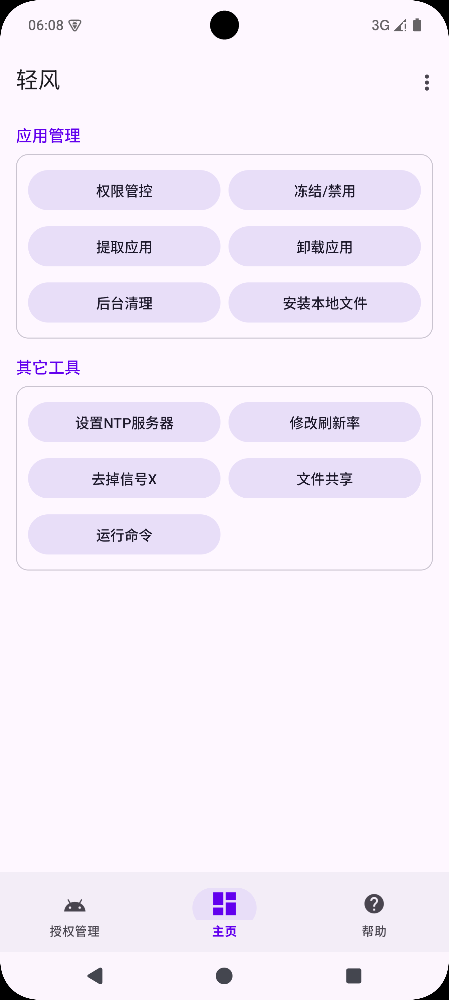
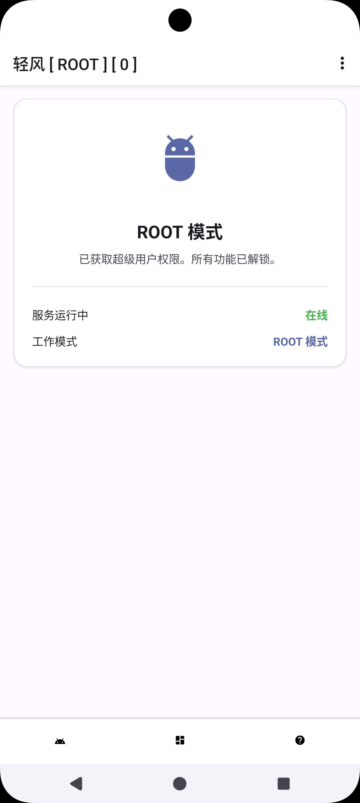
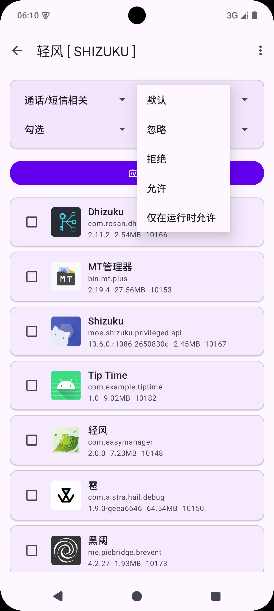
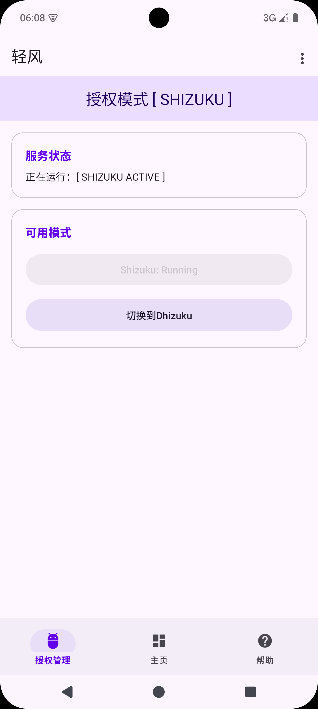
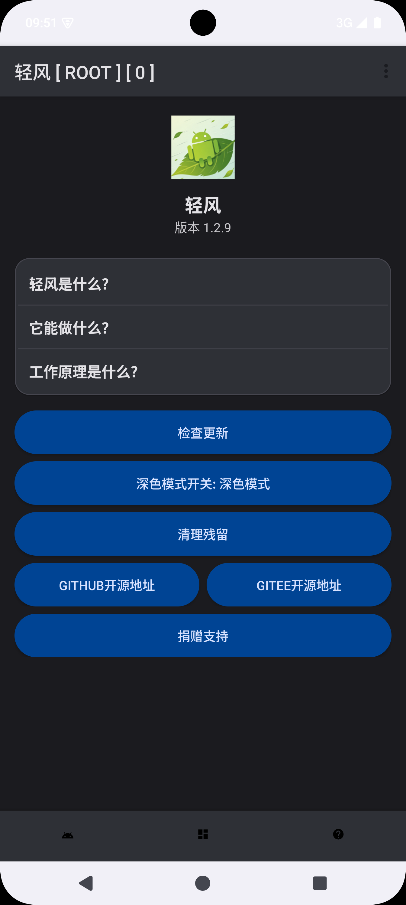
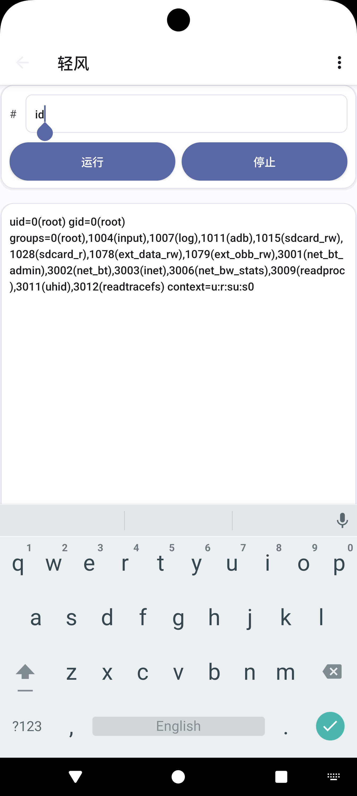
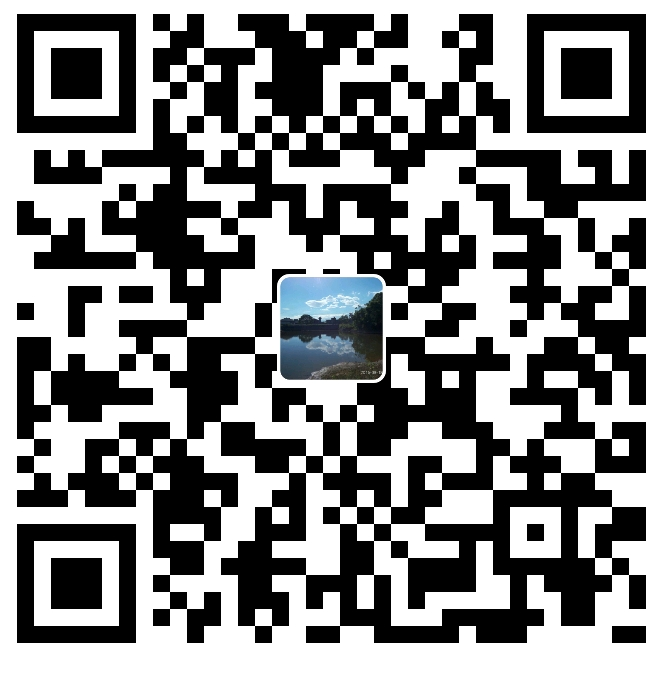

<h1 align="center">Light Breeze No ROOT</h1>

<p align="center">
A lightweight, core-focused Android system toolbox dedicated to No ROOT environments
</p>

<p align="center">
🇺🇸 <a href="./README_EN.md">English</a> |
🇨🇳 <a href="./README.md">简体中文</a>
</p>

<p align="center">

<a href="https://github.com/MrsEWE44/LightBreeze/releases">

</a>


</p>


# Introduction

Light Breeze No ROOT is a system management tool designed specifically for users who do not have Root permissions.

It focuses on Chinese OEM customized system environments, running through **Shizuku** and **Dhizuku** dual modes, providing users with efficient, safe, and restrained system management capabilities without compromising system integrity.

Just like its name:

> A light breeze blows by and leaves quietly.  
> No forced changes, no unauthorized intervention.  
> Just do its own thing, maintain restraint, and keep it pure.


---

# Features

Light Breeze No ROOT currently integrates:

- **System App Management**: Force uninstall/disable pre-installed apps, supports restoration after uninstallation.
- **Sensor Permission Management**: Precisely control sensor permissions for individual apps to reduce "Shake-to-jump" ad interference.
- **LAN File Sharing**: Quickly share folders via WiFi for multi-device data transfer.
- **App Automation**: Supports one-click silent installation, batch permission adjustment, and background process cleaning.
- **App Twin Management**: Deeply manage system clones and multi-user environments.
- **Network Access Control**: Implement basic network control functions in a No Root environment.
- **System Toolbox**: Includes practical functions such as app component management and NTP time synchronization optimization.


---

# Operating Modes

## Shizuku Mode

Runs via ADB Shell permissions provided by Shizuku.

Achieves most system-level management functions without Root.

Supports:
- Basic permission adjustments
- App freeze / unfreeze
- System command execution
- Sensor permission control (specific versions)


---

## Dhizuku Mode

Runs via Android Device Owner (Device Administrator) permissions.

Provides more advanced system control capabilities than standard ADB, allowing deep management of system software without Root.

Supports:
- Force uninstall OEM pre-installed apps
- Silent installation and uninstallation
- Cross-user app management
- Deeper system API calls


---

# Technologies Used

Light Breeze is developed based on a modern Android technology stack, ensuring high performance and stability in No Root environments.

## Core Framework
- **Java 21**: Logical development using modern Java features.
- **Android SDK 37**: Closely following the latest Android system version adaptations.
- **Shizuku / Dhizuku API**: Core cross-process communication and permission invocation solutions.
- **Hidden API Bypass**: Breaking through Android system hidden API restrictions.

## System Interaction
- **Binder IPC / AIDL**: Front-end and back-end separation architecture, handling tasks through efficient inter-process communication.
- **Framework API**: Deep invocation of core services such as PackageManager, UserManager, and AppOpsManager.
- **Shell Command**: Executing optimized Shell commands in a controlled environment.

## UI & Interaction
- **Material Design 3**: Adopting Google's latest design specifications to provide a simple and smooth UI experience.


---

# Project Architecture

Light Breeze adopts a front-end and back-end separation architecture, with high-privilege operations handled by an independent service module.

```text
                         User Interface (App)
                            │
                            ▼
              ┌────────────────────────┐
              │ Light Breeze Control   │
              │ UI/Task/Request Manage │
              └───────────┬────────────┘
                          │
                  Binder / AIDL Comm
                          │
          ┌───────────────┴───────────────┐
          ▼                               ▼
    ┌────────────┐                  ┌────────────┐
    │  Shizuku   │                  │  Dhizuku   │
    │ (ADB Perm)  │                  │(Admin Perm) │
    └─────┬──────┘                  └─────┬──────┘
          │                               │
          └───────────────┬───────────────┘
                          │
                          ▼
        ┌─────────────────────────────────┐
        │        Android Framework        │
        │                                 │
        │ PackageManager / ActivityManager│
        │ AppOpsService  / UserManager    │
        └───────────────┬─────────────────┘
                        │
                        ▼
        ┌─────────────────────────────────┐
        │   Underlying Implementation     │
        │                                 │
        │ [Uninstall/Restore][Sensor][FS] │
        └─────────────────────────────────┘
```


---

# What can Light Breeze No ROOT do?

## 1. Force Uninstall System Apps
In Dhizuku mode, it can completely uninstall some system pre-installed software that standard ADB cannot handle. Deeply adapted for VIVO, iQOO, OPPO, OnePlus, realme, HONOR, Samsung, etc.

## 2. Manage "Shake-to-jump" Ads
Supports managing sensor permissions in Android 10 and below (as well as certain controlled modes in higher versions), reducing accidentally triggered ads from the source.

## 3. Minimalist File Sharing
One-click to start a LAN sharing server, allowing access to files on the phone from a computer or other mobile devices without a data cable.

## 4. App Clones and Multi-user Management
Break system limits, manage and create independent user spaces, achieving app multi-instance and isolation.


---

# Screenshots

<p align="center">



</p>

<p align="center">



</p>


---

# Changelog

> [!IMPORTANT]
> Since version V1.2.8b, the project has been divided into [No ROOT Version](https://github.com/MrsEWE44/LightBreeze/tree/md5) and [Full Version (Root)](https://github.com/MrsEWE44/LightBreeze/tree/master), maintained separately.

## V2.0.5

1. Added Dhizuku environment detection and activation features.
2. Optimized help information.
3. Improved the functionality of obtaining local apps.
4. Upgraded target SDK to 37, supporting Android 17.
5. Updated version number to 2.0.5.


---

# Open Source Acknowledgments

The development of this project refers to and learns from the following excellent open source projects, and we express our sincere thanks:

- [Shizuku](https://github.com/rikkaapps/shizuku)
- [Dhizuku](https://github.com/iamr0s/Dhizuku)
- [AndroidHiddenApiBypass](https://github.com/LSPosed/AndroidHiddenApiBypass)
- [AppOpsX](https://github.com/8enet/AppOpsX)
- [Hail](https://github.com/aistra0528/Hail)


---

# Donation and Support

If Light Breeze has helped you, you are welcome to support the author to continue developing more practical features.

<p align="center">

&nbsp;&nbsp;&nbsp;&nbsp;

</p>

---
<p align="center">Made with ❤️ for Android Enthusiasts</p>
