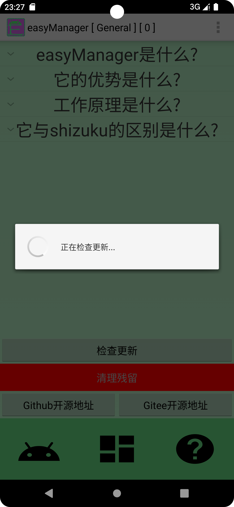
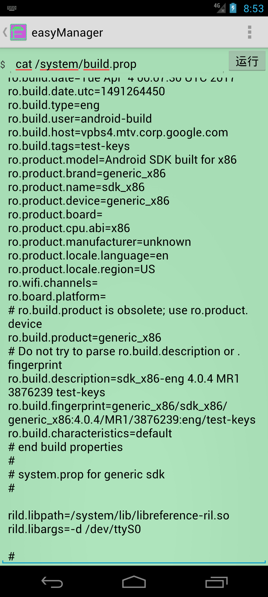
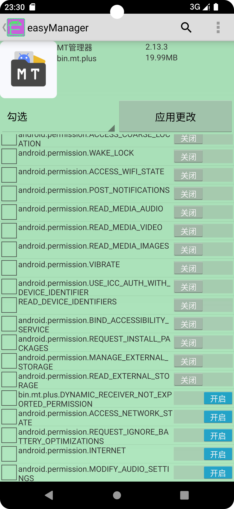

EasyManager was born based on the FQASOSP project to reduce some old content and couple it with new content, eliminating numerous design flaws, improving execution and development efficiency, and opening up many external development interfaces

EasyManager is a lightweight, hardcore, and easy-to-use Android system management tool that is perfect for use on native systems. It also supports older devices such as Android 4.0, as well as the latest Android devices As you can see, it won't give up any old devices that are still in use, it will continue to support it, maybe it's just starting now and not perfect, but it has an infinite future

easyManager supports three modes of operation: adb, root, and device administrator. As you can see, it also supports exposing its private APIs to any authorized application for access
It now provides functions such as batch permission management, freezing/disabling, background process cleanup, silent software installation/uninstallation, individual application service/activity/broadcast/permission management, application network control, backup and recovery, and file sharing
It provides a plethora of one-click functions. All you need to do is read through the help documentation, select the corresponding rule, and finally click that big button, and it will fulfill your expectations

The working principle of easyManager draws inspiration from a series of excellent open-source software such as Shizuku, AppOps, and Hail. Similar to these two, easyManager also requires users to execute a command to launch a separate background process into the shell or root shell in order to function properly
Unlike them, easyManager performs TCP communication through Socket, sending corresponding operation instructions and parameters to execute specific operations. All operations are executed within a single shell, and you can disable it at any time

Unlike Shizuku, easyManager extends its support down to low versions of Android 4.0 and also provides corresponding SDK development kit tools externally. Any third-party programs that integrate with the SDK can use easyManager's complete and proprietary functional API through the SDK. Most commonly used functions do not require developers to implement them again, as easyManager has already encapsulated them. Developers only need to focus on the interface interaction part. Moreover, the externally open interfaces of easyManager have been tested and support Android 4.0 to the latest version, working stably and normally

[easyMangerSDK Development Kit](https://github.com/MrsEWE44/easyManagerSDK)

   
   
   
 

- V1.2.8

1.Improved app cloning feature, supporting automatic deletion of redundant components on Android versions below 8.

2.Fixed the execute command feature.

3.Added device administrator permissions feature, supporting app stop and icon hide functions.

4.Modified some text descriptions.

5.Changed the package naming format.

6.Updated version number to 1.2.8.

- V1.2.7

1.Fixed the app cloning feature.

2.Fixed app disable and freeze functions.

3.Improved file sharing functionality.

4.Initial version of the interface update.

5.Updated target to 36.

6.Changed version number to 1.2.7.

- V1.2.6

1.Optimize the issue of taking too long when retrieving installed apps.

2.Forgot what other issues were fixed.

3.Change the version number to 1.2.6.

- V1.2.5

1.Fixed the problem that the single ISO file selected in U disk mode is stuck.

2.Added the functions of app freezing, data clearing, and scheduled termination of background apps.

3.Boost the compileSdk to 35.

4.Optimize the functional experience.

5.The version number is 1.2.5

- V1.2.4

1.Added a single file selection function in U disk mode.

2.Fix the permission change function.

3.Fix the problem that it is stuck when searching.

4.After the optimizer crashes abnormally, there is a problem of page overlay.

5.Added the functions of command prompt drop-down box, software update, and project address jump.

6.Optimize more details.

7.The modified version number is 1.2.4

- V1.2.3b

1.Improve the app deletion function so that it can delete built-in apps in the system normally.

2.Optimize the operation interface and delete redundant button options.

3.Add Android 4.0.x minimum support.

4.Add the function interface of running commands.

5.Update the Gradle version of the easyManager project.

6.The modified version number is 1.2.3b

- V1.2.3a

1.Improve the backup and restore function of the doppelganger application.

2.Update the easyManager SDK and synchronize the easyManager API.

3.The modified version number is 1.2.3a

- V1.2.3

1.Added application clone function.

2.Add multi-user management and operation functions.

3.Modify the version number to 1.2.3

- V1.2.2a

1.Fix the install local apk file not show apk icon.

2.Modify the version number to 1.2.2a

- V1.2.2

1.Fix the problem of failure to disable application components

2.Update target to 34

3.Modify the version number to 1.2.2

- V1.2.1

1.Fix the problem that obb cannot be backed up during backup

2.Change the application extraction save path

3.Modify the version number to 1.2.1

- V1.2

1.Fix many bugs

2.Optimize some operation details

3.Add multiple languages and change according to system language changes

4.Modify the version number to 1.2

- V1.1

1.Fixed the problem that the options in the selection bar cannot take effect.

2.Fixed the problem that the file sharing path cannot display the complete content

3.Fixed the problem that permission modification cannot be used normally on Android 13

4.Modify the version number to 1.1

- V1.0

First build.