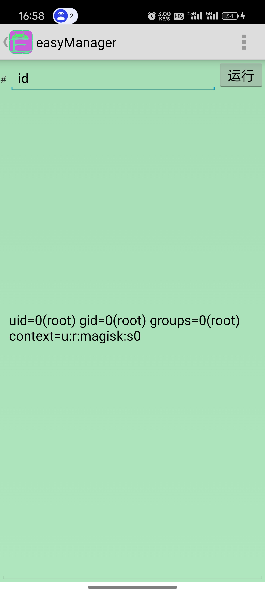
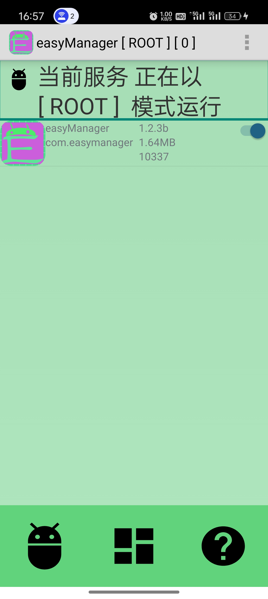
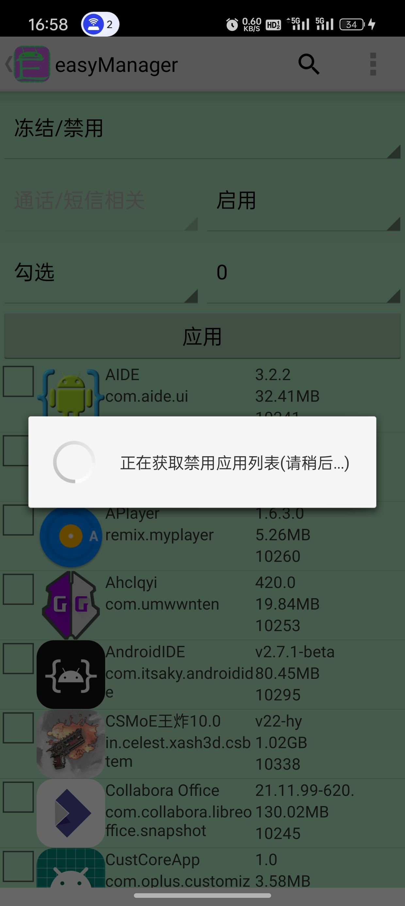
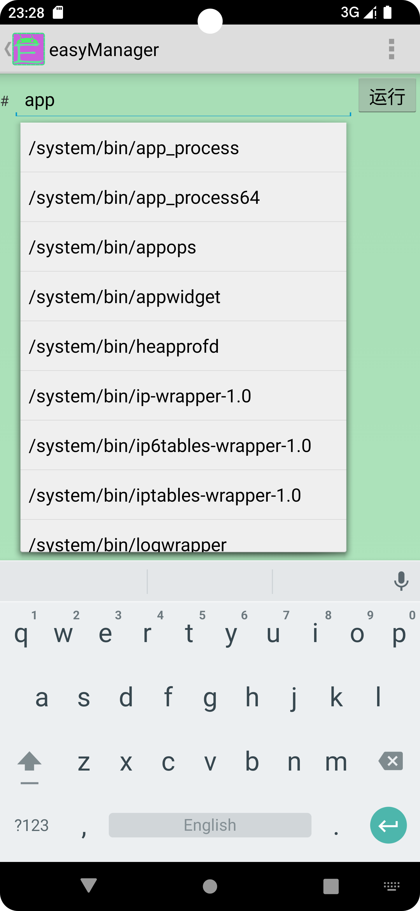

easyManager was born based on the FQAOSP project by cutting out some old content and coupling its new content. It eliminated many design flaws, improved execution and development efficiency, and opened many external development interfaces.

EasyManager is a lightweight, core, and easy-to-use Android system management tool that is perfect for use on native systems. It also supports old devices like Android 4.0, as well as new devices like Android 14. As you can see, it will not give up on any old devices that are still in use, and it will continue to support it. Although it may not be perfect at the beginning, it has an infinite future.

EasyManager supports both adb and root modes of operation, and as you can see, it also supports exposing its private API to any authorized application for access
It now provides batch permission management for applications, background process cleaning, silent software installation/uninstallation, individual application services/activities/broadcasting/permission management, application network control, backup and recovery, file sharing and other functions
It provides a large number of one click functions. You just need to read the help document, select the corresponding rule, and finally click the big button to complete your expectations.

The working principle of easyManager draws inspiration from Shizuku and AppOps. Similar to these two, easyManager also needs to open a separate backend process into the shell or root shell in order to function properly
Perform TCP communication through Socket and perform corresponding operations.

Unlike Shizuku, EasyManager has expanded its support for Android 4.0 lower versions and also provides corresponding SDK development kit tools externally. Any third-party program that connects to the SDK can use EasyManager's complete and private functional interfaces through the SDK. Most commonly used functions do not require developers to implement them again. EasyManager has already been fully encapsulated, and developers only need to focus on the interface interaction part
Moreover, the interface open to the public by EasyManager has been tested and supports Android 4.0 to Android 14. They work stably and normally.

[easyMangerSDK Development Kit](https://github.com/MrsEWE44/easyManagerSDK)

   
   
   
 

- V1.2.6

1.Optimize the issue of taking too long when retrieving installed apps.

2.Forgot what other issues were fixed.

3.Change the version number to 1.2.6.

- V1.2.5

1.Fixed the problem that the single ISO file selected in U disk mode is stuck.

2.Added the functions of app freezing, data clearing, and scheduled termination of background apps.

3.Boost the compileSdk to 35.

4.Optimize the functional experience.

5.The version number is 1.2.5

- V1.2.4

1.Added a single file selection function in U disk mode.

2.Fix the permission change function.

3.Fix the problem that it is stuck when searching.

4.After the optimizer crashes abnormally, there is a problem of page overlay.

5.Added the functions of command prompt drop-down box, software update, and project address jump.

6.Optimize more details.

7.The modified version number is 1.2.4

- V1.2.3b

1.Improve the app deletion function so that it can delete built-in apps in the system normally.

2.Optimize the operation interface and delete redundant button options.

3.Add Android 4.0.x minimum support.

4.Add the function interface of running commands.

5.Update the Gradle version of the easyManager project.

6.The modified version number is 1.2.3b

- V1.2.3a

1.Improve the backup and restore function of the doppelganger application.

2.Update the easyManager SDK and synchronize the easyManager API.

3.The modified version number is 1.2.3a

- V1.2.3

1.Added application clone function.

2.Add multi-user management and operation functions.

3.Modify the version number to 1.2.3

- V1.2.2a

1.Fix the install local apk file not show apk icon.

2.Modify the version number to 1.2.2a

- V1.2.2

1.Fix the problem of failure to disable application components

2.Update target to 34

3.Modify the version number to 1.2.2

- V1.2.1

1.Fix the problem that obb cannot be backed up during backup

2.Change the application extraction save path

3.Modify the version number to 1.2.1

- V1.2

1.Fix many bugs

2.Optimize some operation details

3.Add multiple languages and change according to system language changes

4.Modify the version number to 1.2

- V1.1

1.Fixed the problem that the options in the selection bar cannot take effect.

2.Fixed the problem that the file sharing path cannot display the complete content

3.Fixed the problem that permission modification cannot be used normally on Android 13

4.Modify the version number to 1.1

- V1.0

First build.